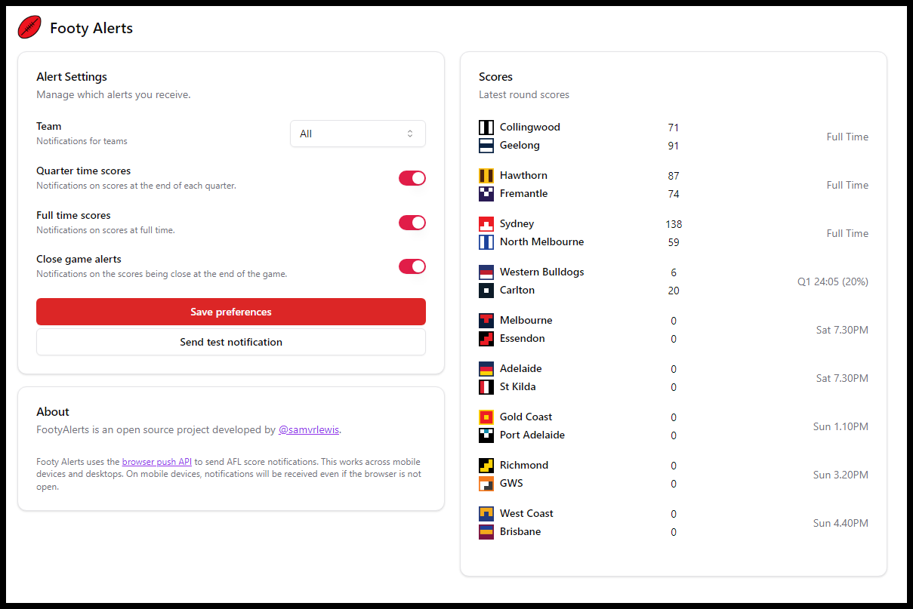

# Footy Alerts

A progressive web app that sends push notifications for AFL football games. Available live at [**footyalerts.fyi**](https://footyalerts.fyi)!

# Architecture

## Backend
The backend is in Rust, using [Axum](https://github.com/tokio-rs/axum) to serve an API that allows users to register for notifications and allows them to see up to date game scores.

The Axum server runs a long running task that subscribes to the [Squiggle Event API](https://api.squiggle.com.au/) in order to get up to date game events.

Hosted on [fly.io](https://fly.io). Storage is to a SQLite database that is constantly replicated to Cloudflare R2 using [Litestream](https://github.com/benbjohnson/litestream). 

## Frontend
Frontend is built using [Svelte](https://svelte.dev/) with components from [Shadcn Svelte](https://www.shadcn-svelte.com/).

# Possible Improvements

- Native app
  - Unfortunately web push seems to be poorly supported by most browsers, alerts can take some time to be delivered. It's also a hassle to install the app on iOS.
- Multi subscriptions
  - Would be nice to be able to subscribe to, for example, all Geelong game events and also all close game events.

